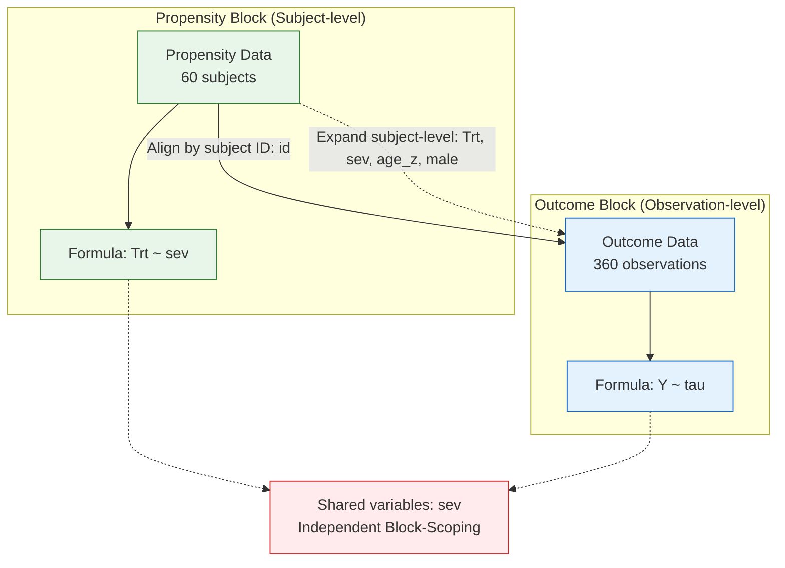

# bjlm

**Bayesian Joint Longitudinal Modelling** — causal inference for longitudinal observational studies with smooth change-points. The core MCMC sampler is written in Rust.

## What bjlm does

`bjlm` jointly estimates propensity scores and outcome trajectories, propagating all sources of uncertainty through to the final causal posterior. It handles time-mismatched covariates via latent Gaussian Processes and supports population-level inference via census-weighted G-computation.

## Key features

- **Smooth change-point model** — piecewise regression with logistic-smoothed transitions; change-point location, slope change, and sharpness can all be functions of covariates
- **Piped declarative API** — `bjlm_model() |> propensity() |> outcome() |> compile() |> fit()`
- **Joint IPW** — propensity scores estimated simultaneously with the outcome; uncertainty propagates into the causal posterior
- **G-computation and AIPW** — doubly robust Average Treatment Effect and marginal Risk Ratio
- **Population inference** — census-weighted G-computation for Population Average Treatment Effect via the `population()` block
- **Latent GP confounders** — models time-varying confounders as continuous-time Gaussian Processes for time-mismatched data
- **Spike-and-slab variable selection** — Kuo-Mallick gamma indicators gate each change-point modifier; `pip(fit)` returns posterior inclusion probabilities; operates inside the IPW block so the Bayesian Cut is preserved
- **Leave-Future-Out CV** — longitudinally-appropriate predictive validation via `lfo_cv()`

## Installation

```r
# Requires Rtools45 on Windows for Rust compilation
pak::pkg_install("ABindoff/bjlm")
```

## Quick start

### Cross-sectional causal inference

```r
library(bjlm)

fit <- bjlm_model() |>
  propensity(Trt ~ X1 + X2, data = dat) |>
  outcome(Y ~ X1, data = dat) |>
  compile() |>
  fit(chains = 4, iter = 2000)

# G-computation ATE with 95% credible interval
fitted(fit, type = "ate")

# Doubly robust AIPW ATE
fitted(fit, type = "aipw_ate")
```

### Longitudinal change-point model

```r
fit_long <- bjlm_model() |>
  propensity(Trt ~ X1, data = dat_subjects) |>
  outcome(
    formula = Y ~ tau,
    b0      = ~ 1 + Trt + X1 + (1 | subject),
    b1      = ~ 1,
    deltas  = list(~ 1 + Trt),
    omega   = list(~ 1),
    rho     = list(~ 1),
    data    = dat_longitudinal
  ) |>
  compile() |>
  fit(chains = 4, iter = 2000)
```

### Population inference

When the study cohort does not represent the target population, census weights correct for covariate shift:

```r
census_df <- data.frame(
  age_grp = c("young", "young", "old", "old"),
  sex     = c("M", "F", "M", "F"),
  N_pop   = c(1200, 1100, 900, 800)
)

fit_pop <- bjlm_model() |>
  propensity(Trt ~ X1 + age_z, data = dat_subjects) |>
  outcome(
    Y ~ tau,
    b0   = ~ 1 + Trt + X1 + age_z + (1 | subject),
    b1   = ~ 1,
    data = dat_longitudinal
  ) |>
  population(cells = census_df, weight = "N_pop", at = list(tau = 0:5)) |>
  compile() |>
  fit(chains = 4, iter = 2000)

# Population-weighted outcome trajectory
population_predict(fit_pop, type = "response")

# Population Average Treatment Effect (PATE) over time
population_predict(fit_pop, type = "ate")
```

## The smooth change-point model

$$\mu_{ij} = b_{0j} + b_1(\tau_{ij} - \omega_1) + \sum_{k=1}^K \delta_k (\tau_{ij} - \omega_k)\,\sigma\!\left(\rho_k(\tau_{ij} - \omega_k)\right)$$

where $\sigma$ is the logistic sigmoid. Each of $b_0$, $b_1$, $\delta_k$, $\omega_k$, and $\rho_k$ can be a linear function of covariates, including random effects. The change-point $\omega_k$ is the point of maximum structural curvature; $\rho_k$ controls how abruptly the slope changes there.

## Causal inference

`bjlm` enforces the **Bayesian Cut** (Plummer, 2015): the propensity model is fitted with IPW-corrected MCMC and the outcome model cannot feed back into propensity estimation. Post-processing provides:

| Call | Estimand |
|------|----------|
| `fitted(fit, type = "ate")` | G-computation ATE (sample) |
| `fitted(fit, type = "rr")` | G-computation marginal Risk Ratio |
| `fitted(fit, type = "aipw_ate")` | Doubly robust AIPW ATE |
| `fitted(fit, type = "aipw_rr")` | Doubly robust AIPW Risk Ratio |
| `population_predict(fit, type = "ate")` | Population Average Treatment Effect |
| `population_predict(fit, type = "rr")` | Population marginal Risk Ratio |

### Weight diagnostics

```r
plot_propensity(fit, type = "both")   # overlap and weight distribution
weight_diagnostics(fit)               # ESS, trimming advice, positivity
```

## Model flowchart

`flowchart()` generates a [Mermaid](https://mermaid.js.org/) diagram of the compiled model's data flow — useful for verifying alignment, shared-covariate scoping, and the cut-posterior boundary.

```r
compiled_model <- bjlm_model() |>
  propensity(Trt ~ sev, data = dat) |>
  outcome(
    Y ~ tau,
    b0     = ~ 1 + Trt + sev + (1 | id),
    b1     = ~ 1,
    deltas = list(~ 1 + Trt + sev + age_z + male),
    omega  = list(~ 1),
    rho    = list(~ 1),
    data   = dat
  ) |>
  compile()

flowchart(compiled_model)
```



Both subgraphs sit inside a yellow background. Nodes in the propensity block (left) are green; nodes in the outcome block (right) are blue. A solid arrow labelled with the subject ID variable links the two blocks; a dashed arrow lists the covariates that are expanded from subject-level to observation-level. The red node at the bottom flags covariates shared between the two model formulas — these are scoped independently under the Bayesian Cut.

## Vignettes

| Vignette | Topic |
|----------|-------|
| `vignette("getting-started", package = "bjlm")` | GP confounders, LFO-CV, full walkthrough |
| `vignette("population-inference", package = "bjlm")` | Census-weighted PATE |
| `vignette("spike-and-slab", package = "bjlm")` | Variable selection at the change-point via spike-and-slab |
| `vignette("model_comparisons", package = "bjlm")` | Validation against brms and Stan |
